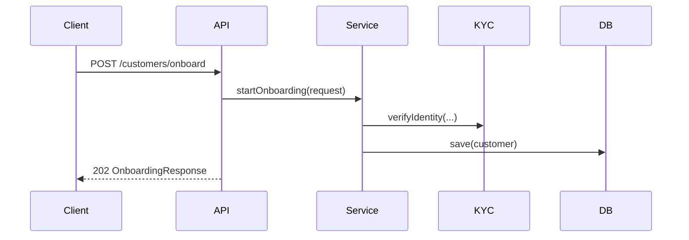

# API Examples

## Start onboarding request

```json
{
  "email": "max.mustermann@example.com",
  "firstName": "Max",
  "lastName": "Mustermann",
  "birthDate": "1984-04-21",
  "referralCode": "PARTNER-42"
}
```

## Start onboarding response

```json
{
  "customerId": "cus_12345",
  "status": "ACTIVE",
  "riskScore": 35,
  "kycReference": "KYC-2026-0001"
}
```

## SOAP KYC status request

```xml
<soapenv:Envelope xmlns:soapenv="http://schemas.xmlsoap.org/soap/envelope/" xmlns:kyc="https://acme.example/kyc">
  <soapenv:Body>
    <kyc:GetKycStatusRequest>
      <kyc:kycReference>KYC-2026-0001</kyc:kycReference>
    </kyc:GetKycStatusRequest>
  </soapenv:Body>
</soapenv:Envelope>
```

## Mermaid overview


