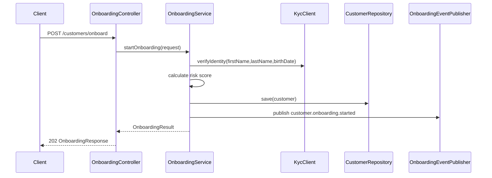

# Customer Onboarding Flows

## REST onboarding example

Example request:

```json
{
  "email": "ada.lovelace@example.com",
  "firstName": "Ada",
  "lastName": "Lovelace",
  "birthDate": "1815-12-10",
  "referralCode": "FRIEND-42"
}
```

Example response:

```json
{
  "customerId": "cst_123",
  "status": "ACTIVE",
  "riskScore": 20,
  "kycReference": "kyc_789"
}
```

## Mermaid sequence



## Business rule example

If the KYC provider rejects the identity or the risk score is above 70, the customer is marked for manual review. Otherwise the customer is activated.
